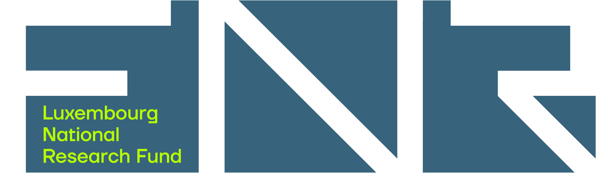
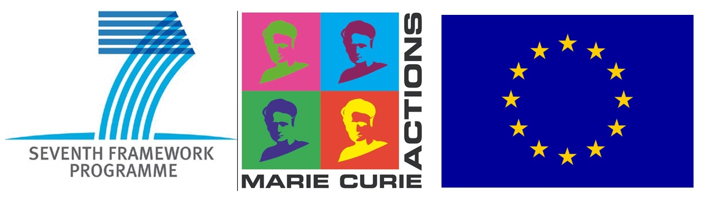
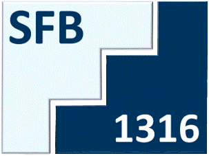

# Contributions & Funding

All the work presented would only be possible with the scientific and financial support of my

* former and current supervisors: [Prof. R.J. Behm](https://scholar.google.com/citations?user=YVNprrsAAAAJ&hl=en),
[Prof. H.E. Hoster](https://scholar.google.com/citations?user=hg2yr7sAAAAJ&hl=en&oi=ao),
[Prof. I. Chorkendorff, Prof](https://scholar.google.com/citations?user=QwXnsaoAAAAJ&hl=en&oi=ao),
[I.E.L. Stephens](https://scholar.google.com/citations?user=E9Ji7icAAAAJ&hl=en&oi=ao),
[Dr. Sylvain Brimaud](https://scholar.google.com/citations?user=9DZWcP8AAAAJ&hl=en&oi=ao) and
[Prof. T. Jacob](https://scholar.google.com/citations?user=vMi0ElwAAAAJ&hl=en&oi=ao).
* collaborators (see co-authors on [publications](https://scholar.google.com/citations?user=zz6G_wsAAAAJ&hl=en))
* [colleagues](https://www.uni-ulm.de/en/nawi/institute-of-electrochemistry/)
* collaborators at [echemdb](https://github.com/echemdb)
* my family

as well as the funding received over the years.

 (2010-2014)

 (2015-2017)

 (2022-)
