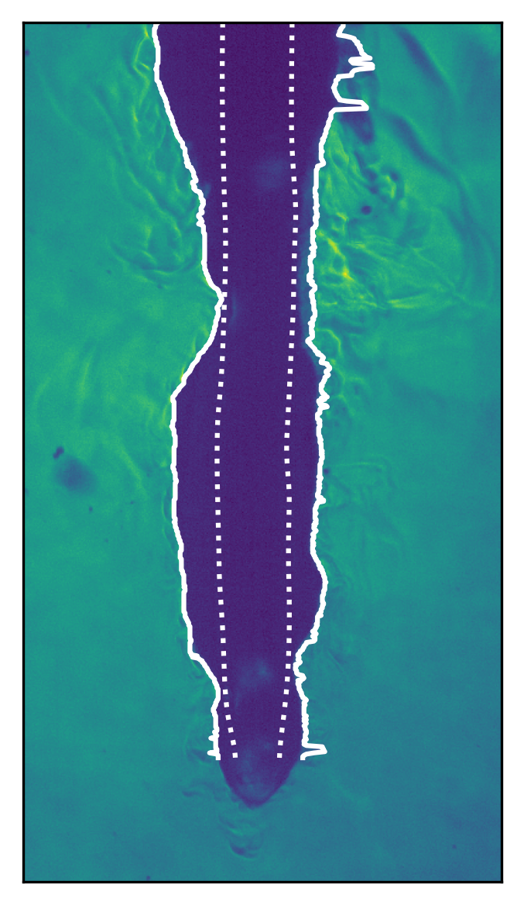
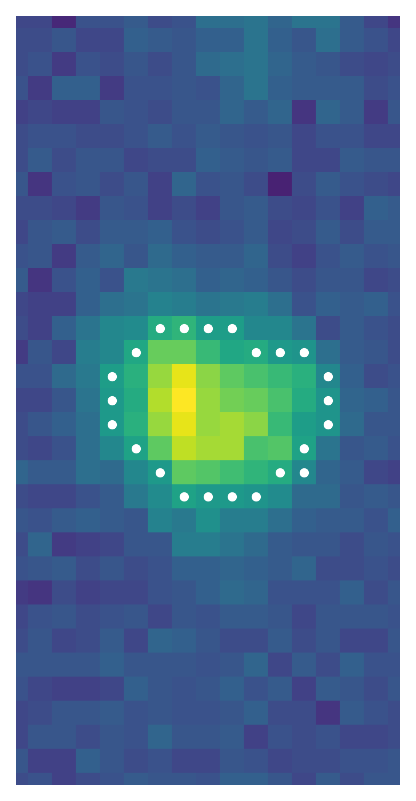
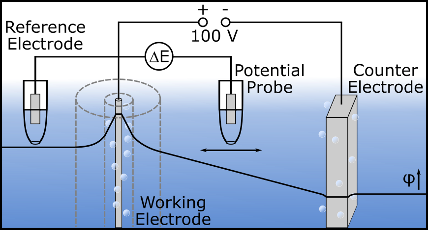
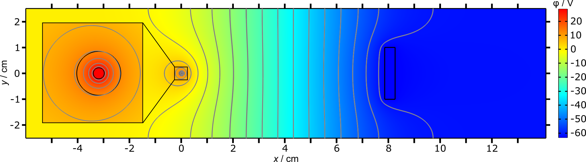

# Research

My research focuses on the fundamental understanding of structures and processes on the nano and micrometer scale in the research areas of solid liquid interfaces, electrocatalysis and plasma electrolysis.
To address these questions I employ surface science methods (under UHV and laboratory conditions) and electrochemical techniques. More recently I also explore the use of databases, automated workflows and artificial intelligence in this research context. The data driven research is explained on the [RDM](rdm.md) and [echemdb](echemdb.md) subpages.


(plasma-electrolysis)=
## Plasma Electrolysis

Upon applying a high voltage (tens to several 100 V) between a comparably small working and large counter electrodes, leads to the formation of a vapor layer between the electrode and electrolyte, in which a plasma can be ignited. This has an effect on the structural properties of the electrode and the composition of the electrolyte.{cite}`artmann_structural_2021,artmann_using_2022,artmann_nanoporous_2022` To understand these outcomes, we aim at gaining a fundamental understanding of the processes within the vapor layer, in dependence of the electrode material, electrolyte composition and external parameters such as voltage and temperature.{cite}`forschner_electric_2023,forschner_statistical_2025,forschner_characterization_2026`
The work on plasma electrolysis is funded within the [SFB-CRC1316](https://sfb1316.rub.de/index.php/en/) in project B12.

### Plasma properties

The term plasma electrolysis is often framed as contact glow discharge electrolysis (CGDE), which does not seem to be appropriate to describe the underlying plasma and rather reflects a combination of arc and glow like behavior.{cite}`forschner_characterization_2026`

```{figure}
:label: fig-plasma-properties
:class: grid grid-cols-2

<video controls style="width: 100%;" src="files/figures/research/plasma/Au_300Vcat_vapor_layer.mp4"></video>

<video controls style="width: 100%;" src="files/figures/research/plasma/Au_300Vcat_discharges.mp4"></video>





Temporal evolution of the vapor layer (left) and appearance of individual discharges (right).{cite}`forschner_characterization_2026`
```

### Electrolyte properties

Due to the high currents in plasma electrolysis a major power loss is attributed to the ohmic resistance of the electrolyte.{cite}`forschner_electric_2023` The good side of it is, that this voltage drop can be measured, which allows studying properties relevant for the plasma generation, i.e., the voltage drop across the vapor layer. These studies also revealed that the applied voltage is not a good descriptor for comparison between experiments, but rather the current density at the driving electrode.

```{figure}
:label: fig-voltage-drop
:class: grid grid-cols-2





Voltage drop measurement setup (left) and COMSOL simulation of the potential distribution in the electrolyte (right).{cite}`forschner_electric_2023`
```

### Electrode Restructuring

Focusing on materials relevant for electrocatalysis, E.Artmann found that the changes in the structural properties of Au, Cu and Pt, depend on the nature of the material, the crystallographic orientation, and the time the electrodes were exposed to the electrolyte after the electrolysis. The latter is due to the chemical interaction of the electrode and $\ce{H2O2}$ formed during the plasma electrolysis.{cite}`artmann_structural_2021,artmann_using_2022,artmann_nanoporous_2022,artmann_facet_2023`
Au is a particularly interesting system, as plasma electrolysis allows for the creation of nanoporous Au (NPG - a highly porous black structure) within a few seconds in $\ce{KOH}$ solutions, which by other means would require significantly more time, preparation steps, and various chemicals.{cite}`artmann_nanoporous_2022,artmann_facet_2023`

```{figure} files/figures/research/plasma/overview_restructuring.png
:label: fig-electrode-restructuring
:height: 200px

Structural evolution of Au, Cu and Pt anodes upon plasma electrolysis.{cite}`artmann_structural_2021`
```

The plasma can evaporate the electrode or sputter material from the electrode, which can be used for nanoparticle formation in the solution, illustrated by L. Forschner for Au-NP formation during cathodic plasma electrolysis.{cite}`forschner_characterization_2026`

````{figure}
:label: fig-np-formation
:class: grid grid-cols-2

```{image} files/figures/research/plasma/Np_formation_evaporation.png
:alt: NP formation mechanism
```

```{image} files/figures/research/plasma/NP_TEM_Image.png
:alt: Au nanoparticles
:height: 200px
```

Schematic of the nanoparticle formation mechanism during cathodic plasma electrolysis (left) and resulting Au nanoparticles in solution studied on a TEM grid (right).
````

### OER catalysts

This project aimed at exploring, if Ni electrodes could be modified by [plasma electrolysis](#plasma-electrolysis), to improve its performance in alkaline electrolysers, in collaboration with [Sylvain Brimaud](https://scholar.google.com/citations?user=9DZWcP8AAAAJ&hl=fr) at the ZSW.
However, we got distracted, and J. Leist found that during the OER the commonly accepted $\ce{NiOOH}$ terminated surface rather consists of $\ce{NiO2}$, based on our combined surface enhanced Raman spectroscopy (SERS) measurements and DFT calculation.
Another key finding is that the SERS spectrum of $\ce{NiO2}$ contains overtones, which are little explored and usually not considered.
Our results on Co and Mn-based oxides indicate that these overtones might be related to the layered structure of the material.{cite}`leist_consequences_2025`

```{figure} ./files/figures/research/ni_oer_raman_dft.png
:height: 300px
:name: fig-ni-oer-raman

Experimental SE and DFT computed Raman spectrum of $\ce{NiO2}$, including the overtone region and a 3D ball model.{cite}`leist_consequences_2025` (kindly provided by Justus Leist)
```

## Single crystal electrodes

I study the structural properties, stability, and (electro)chemical and catalytic activity of bare and admetal-modified metal single crystal electrodes.{cite}`schnaidt_combined_2017`
Clean and well-defined surfaces serve as model systems to understand fundamental processes at electrode–electrolyte interfaces, such as adsorption, surface reconstruction, and electrocatalytic reactions relevant to energy conversion.{cite}`engstfeld_potential_2014`


(ru0001)=
### Ru(0001)

Somehow this is my favorite system 😌. It served me as a template during my PhD to study numerous bi- and trimetallic adlayer structures including NP growth on graphene modified Ru(0001).{cite}`engstfeld_growth_2012,engstfeld_directed_2012,engstfeld_kinetic_2016,mancera_challenges_2017,han_atomistic_2013,han_atomistic_2013b,liu_growth_2015`

<!--AKE placeholder: need to find a fitting figure-->

It was also the first system that I studied when I started doing electrochemistry, which was rather complicated, since the system was not yet well explored.
Some of the unclear features took me (with some breaks) several years to resolve, using a DEMS flow cell attached to a UHV chamber{cite}`schnaidt_combined_2017` and had the chance to perform SXRD measurements with [Jakub Drnec](https://scholar.google.de/citations?user=3HEOUVgAAAAJ&hl=en&oi=ao) at the ESRF.{cite}`engstfeld_ru0001_2021`

The main reason is that Ru(0001) interacts very strongly with adsorbates and in some cases ($\ce{H2SO4}$), the surface redox processes show a strong hysteresis.{cite}`engstfeld_ru0001_2021` The consequence of this strong interaction is that hydrogen can be evolved as anodic $\ce{H2}$ at more positive potentials than the equilibrium potential for the hydrogen evolution reaction.{cite}`engstfeld_ru0001_2021,scott_anodic_2020` Second, the ORR activity on this electrode strongly depends on the type of adsorbate, which can lead to significant formation of $\ce{H2O2}$,{cite}`engstfeld_impact_2024` which is not expected from the scaling relations proposed for the ORR for Ru.

Read more on the exciting electrocatalytic properties of admetal-modified Ru(0001) electrodes [below](#admetal).


### Cu(hkl)

During my Postdoc at [DTU Physics (SurfCat)](https://physics.dtu.dk/research/sections/surfcat) I started working on Cu, despite that I wanted to have a closer look at Ru oxides 🙃.
But everyone was into Cu at the time due to the potential use for the electroreduction of $\ce{CO2}$.{cite}`nitopi_progress_2019`

What was striking was, that in contrast to the Pt community, almost no one would publish cyclic voltammograms and detailed studies on single crystal electrodes were missing (aside from numerous works using in situ STM).
In a combined effort studying Cu(100) under UHV conditions by STM and XPS and different types of electrochemical cells, we could at least elucidate the CV for Cu(100).{cite}`engstfeld_polycrystalline_2018`

```{figure} files/figures/research/single_crystal/cu100_cv_stm_xps.png
:height: 300px
:name: fig-cu100-cv-stm-xps

XP spectrum and STM image on the left and corresponding CVs for Cu(100) on the right (Reprinted from {cite}`engstfeld_polycrystalline_2018`, published under a Creative Commons CC BY license (Wiley, 2018))
```

Interestingly at the time at DTU Soren Scott was able to detect anodic $\ce{H2}$ using EC-MS. I immediately thought this was the key to explain some unexplainable observations I made on Ru(0001) during my PhD, which finally during my second Postdoc in Ulm turned out true (see [Ru(0001) above](#ru0001)) and lead to some nice collaborative work.{cite}`scott_anodic_2020`

### echemdb

Finding CV data on single crystals and comparing such data with own data or among each others, was during my studies with single crystals always a tedious task.
To spare future researchers the same pain, some friends, colleagues, and myself devoted ourselves to create a CV database. Read more on echemdb [here](echemdb.md).

```{figure} files/figures/research/echemdb/echemdb_overview.png
:height: 300px
:name: fig-echemdb-pte-research

Periodic table of CVs for transition metal single crystal electrodes, created from the echemdb dataset.
```

(admetal)=
### Ad metal modified electrodes

{cite}`schuttler_adlayer_2020,schuttler_low_2021,schuttler_interaction_2021,beckord_electrochemical_2016,mancera_challenges_2017,engstfeld_kinetic_2016,artmann_facet_2023,engstfeld_formation_2012,engstfeld_growth_2012,engstfeld_directed_2012`

## Stay tuned

More information will follow on various works dealing with, for example, the electrocatalytic activity of bimetallic electrodes
{cite}`engstfeld_electrochemical_2015,engstfeld_potential_2014,klein_atomic_2019,klein_electro_2019,engstfeld_stabilization_2025`
and ionic liquids.{cite}`heubach_assessing_2024,heubach_reproducibility_2024`

<!--AKE: keep as placeholder for further additions
## Electrocatalysis on single crystal electrodes

### CO and MeOH oxidation on Pt modified Ru(0001)

{cite}`engstfeld_electrochemical_2015,engstfeld_potential_2014,klein_atomic_2019,klein_electro_2019,engstfeld_stabilization_2025`

### CO and MeOH on Pt modified surfaces

{cite}`engstfeld_bifunctional_2021,klein_selective_2020`

## Other works I was involved in

{cite}`engstfeld_polycrystalline_2018,nitopi_progress_2019,bertheussen_electroreduction_2018,bogenrieder_first_2024,heubach_assessing_2024,heubach_reproducibility_2024,scott_anodic_2020`
-->
